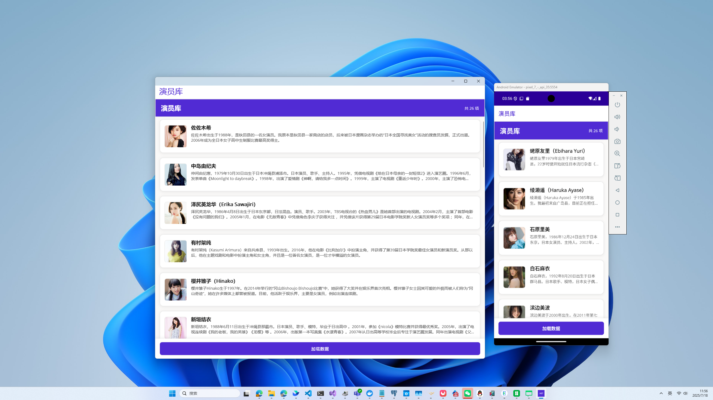
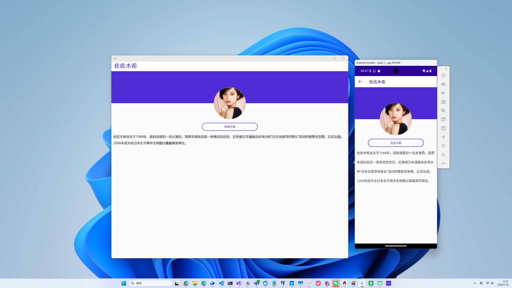

# dotnet-maui-tutorial-code

这是一个maui学习的仓库 主要包含一些maui的用法学习 参考很多的其他的项目

## 参考的项目如下

[dotnet-maui-workshop](https://github.com/dotnet-presentations/dotnet-maui-workshop)

[dotnet-podcasts](https://github.com/microsoft/dotnet-podcasts)

## RuxRobot

乐天派机器人的硬件操作SDK的DEMO，用来控制机器人的动作

https://github.com/user-attachments/assets/90188217-c282-43c4-83c8-fe7d5c28a4f8

 ## ActressLibrary
 
 一个列表展示的项目，主要测试maui使用litedb作为本地数据库展示一些数据。直接使用了 dotnet-maui-workshop的模版，效果如下：

## Braincase
一个适配了安卓系统的表盘app，外加一个内置了signalr实时通讯的webapi，用来数据的传输，可以采用web控制安卓app的表盘和内容切换，tts语音。
主要是用来给乐天派桌面机器人使用，效果如下图左边：

